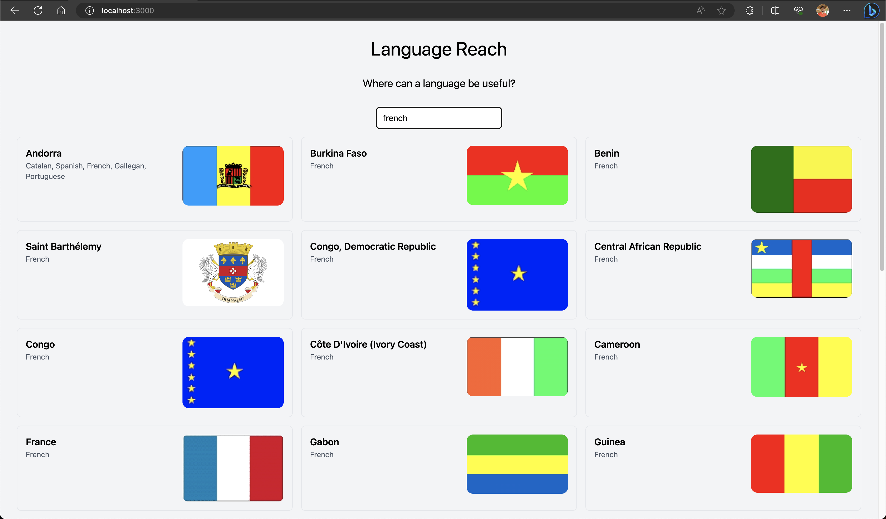

# language-reach

The language you learn can help in you in these countries!



## local setup

Make sure you have node installed.

### run the mesh

```bash
cd src/mesh
npm i
npm run dev
```

### run the ui

```bash
cd src/language-reach
npm i
PROXY_BACKEND_URL=http://localhost:4000 npm run dev -- --port 3000
```